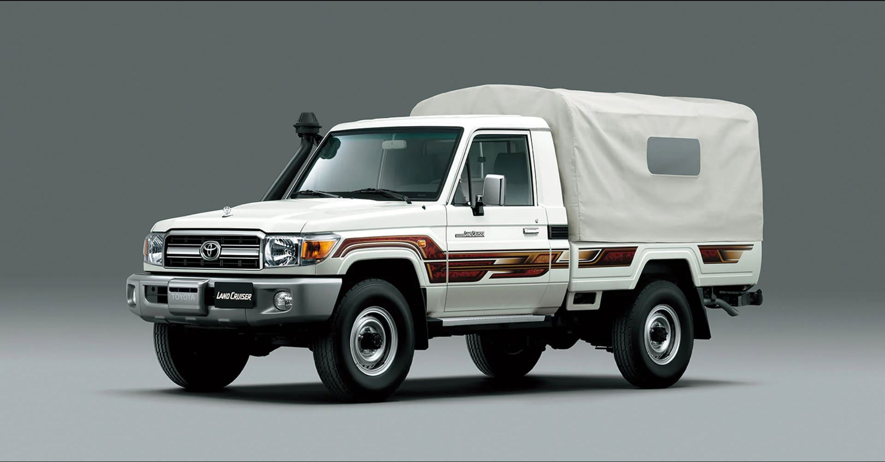

# CURSO DE FLEXBOX.


[link](https://diegotvramos.github.io/curso-flexbox/)


## (1/13) Introducción

Es uno de los dos grandes módulos de CSS con los que contamos para hacer maquetación.

el año 2012 es cuando se empieza implementar flexbox.

Te recomiendo la guia completa de [css-tricks](https://css-tricks.com/) uno de los mejores blogs para aprender desarrollo frontend

https://css-tricks.com/snippets/css/a-guide-to-flexbox/

algunos Frameworks como bootstrap, bulma, materializecss estan maquetadas con flexbox. busca row.

Muchas de las plantillas, de wordpress de drupal están maquetadas con esos frameworks, muchos desarrolladores backends no se complican y utilizan estos frameworks.

> te recomiendo que te descargues la extención: **CSS Flexbox Cheatsheet**


> ``Ctrl + shift + p `` puedes ver una pequeña guia en e vscode.

## (2/13) Conceptos Básicos 

flexbox es un sistema unidimencional(o tenemos filas o tenemos columnas) vamos a tener filas o vamos a tener columnas pero no podemos tener ambas


propiedad **Display** el comportamiento por defecto de los hijos de una caja fexbox y se van a aliniear y la direccion por defecto es horizontal (Fila)

```css
    .container{
    background-color: #333;
    display: flex;
    display: inline-flex; /*hace que todos trabajen en linea*/
    display: flex; /*Se usa más el valor de FLEX*/
}

.item{
    background-color: cyan;
}

```

## (3/13) El flujo de Flexbox ( flex-direction + flex-wrap )

la propiedad **Flex direction**


```css
    /*El tamaño de la caja se comienza a considerar a partir del contenido si nosotros trabajamos Paddings, Border, Margin
    eso va aumentar el tamaño de la caja, por eso lo debemos RESETEAR el tamaño de la caja a box-sizing
*/
*,
*::after,
*::before{
    box-sizing: border-box; /*ya no considera desde el contenido sinó desde el border*/
}
.container{
    background-color: #333;
    height: 30vh;
    display: flex;
    display: inline-flex; /*hace que todos trabajen en linea*/
    display: flex; /*Se usa más el valor de FLEX*/
    flex-direction: row; /*por default*/
    flex-direction: column;
    /*no envuelvas. por default tambien depende de flex-direction*/
    flex-wrap: nowrap; /*va a tratar de alinear todo sus hijos en una sola linea (envoltorio)*/
    flex-wrap: wrap; /*si no caben genera otras filas abajo Lo usa Bootstrap*/
    flex-wrap: wrap-reverse;
    flex-flow: column wrap ;/*Shorthand de flex-direction y flex-wrap*/

    
}

.item{
    border: medium solid red;
    width: 20%;
    height: 20%; /*ya empieza a regir este valor por que la direcion es Column*/
    background-color: cyan;
}
```

## (4/13) Alineación del Main Axis ( justify-content )

Define la alineación de los elementos hijos, respecto del Eje pricipal(está definido por la propiedad flex-direction).

La propiedad Justify-content tiene 6 valores:


Toda las alineaciones tienen efecto si sobra espacio.


## (5/13) Alineación del Cross Axis ( align-items y align-content )

**align-items**

Funciona por cada linea que tengamos. Define la alineación de los hijos en el eje transversal (cross axis) dentro de cada linea. 


Align-item trabaja de manera independiente por cada linea o columna que nosotros tengamos, pero si queremos alinear los elementos hijos como un todo tenemos a otra propiedad: align-content

**align-content**

Define la alineación de los hijos en el eje transversal (cross axis), no funciona cuando los hijos están en UNA sóla linea(CUANDO FLEX:NOWRAP NO FUNCIONA)


los elementos que tiene alto y ancho definido tienen mayor peso

trabaja en conjunto como si toda las lineas ya sean filas o columnas fuera uno solo


Cuando ya estamos maquetando sitios web nos podemos encontrar con un centrado perfecto una maquetacion fluida un stiki footer una cabecera stiky


```css
    .container{
    background-color: #333;
    height: 30vh;
    
    display: flex; /*define que una caja será  flexbox de bloque  o flexbox de linea*/
    display: inline-flex; /*hace que todos trabajen en linea*/
    display: flex; /*Se usa más el valor de FLEX*/
    flex-direction: row; /*por default*/
    flex-direction: row-reverse;
    flex-direction: column;
    flex-direction: column-reverse;
    flex-direction: row; /*Define el eje principal(main-axis) row - x & column - y*/
    flex-direction: column;

    /*no envuelvas. por default tambien depende de flex-direction*/
    flex-wrap: nowrap; /* por default va a tratar de alinear todo sus hijos en una sola linea (envoltorio)*/
    flex-wrap: wrap; /*si no caben genera otras filas abajo Lo usa Bootstrap*/
    /*define si la caja flexbox envuelve o NO a sus hijos*/
    flex-wrap: wrap-reverse;

    flex-flow: row wrap ;/*Shorthand de flex-direction y flex-wrap*/
    flex-flow: row nowrap ;
    flex-flow: row wrap ;
    /* flex-flow: column wrap ; */

    justify-content: flex-start;
    justify-content: flex-end;
    justify-content: center;
    justify-content: space-between;
    justify-content: space-around;/*mmm me parece que no se usa mucho porque no tiene simetria*/
    justify-content: space-evenly;/*los espacios ahora si son proporcionales*/
    justify-content: flex-start;

    align-items: stretch; /*por defecto*/
    align-items: start;
    align-items: center;
    align-items: flex-end;
    align-items: baseline; /*los elementos se alinean ala linea del texto*/
    align-items: start;
    align-items: baseline;
    align-items: center;

    align-content: stretch; /*valor por defecto*/
    align-content: flex-start;
    align-content: center;
    align-content: flex-end;
    align-content: space-between; /*no considera las orillas*/
    align-content: space-around;/*considera las orillas, pero se desborda*/
    align-content: space-evenly; /**/
}

.item{
    border: medium solid red;
    /* width: 20%; */
    height: 20%; /*ya empieza a regir este valor por que la direcion es Column*/
    background-color: cyan;
}

/* .item:nth-child(even){
    font-size: 2.5rem;
} */
```

## (6/13) Factor de Crecimiento ( flex-grow ) 


```css
    .item{
    border: medium solid red;
    /* width: 20%; */
    /*height: 20%; /*ya empieza a regir este valor por que la direcion es Column*/
    /* width: 100px; */
    background-color: cyan;

    flex-grow: 0;
    flex-shrink: 1;
    flex-basis: auto;
}
```

**flex-grow:0;**

Cuando la caja fex-box tenga **espacio sobrante** los hijos va a poder aprovechar ese espacio sobrante, por que flex grow es el factor de crecimiento, valor por defecto es 0, NO se aceptan valores negativos

eje contenedor 1000px
    3 items de 100px
    El espacio sobrante es 700, lo dividimos a 3 y para cada uno corresponde a 233.33 mas 100px sumados cada un le corresponderia  333.33px. 

    ahora si uno de los hijos tiene el factor de crecimiento de 2 dos entonces 700 lo dividimos entre 4 = 175 al item 1 y 3  le corresponden (100+175) y al item 2 (100+175+175)=450px

**flex-shrink:1;**

Cuando la caja flexbox NO tenga espacio sobrante, es la habilidad o el factor de encogerse, valor por defecto es 1, NO se aceptan valores negativos.


## (7/13) Factor de Reducción ( flex-shrink )


Cuando una caja no tiene un tamaño especifico el valor que toma es el valor automático osea, ocupan el espacio que requieren segun la cantidad de letras, si le metemos mas texto a un item este crece. 

si lo encojemos los items se encojen, es a la inversa de flex-grow

``flex-shrink: 1;`` cuando está con esté valor  los items se encojen
``flex-shrink: 0;`` cuando está con esté valor  los items ya no se encojen, mentienen su tamaño fijo.

El contenedor padre mide (79.11*3)=237.33 siguidamente al contenedor padre lo reducimos a 200px sobran 37.33px.

si ese valor de (37.33/3)= 12.443 es lo que debemos restar a cada item (79.11-12.443 )=66.667

ahora el Item 2 tiene un factor de reduccion del doble entonces => al espacio reducido lo dividimos entre 4 (37.33/4)= 9.332

|-9.332|-18.664|-9.332|

|79.11-9.332|79.11-18.664|79.11-9.332|

|=69.778|=60.446|=69.778|   

Si el conetenedor está reduciendo mas su tamaño y un conetenedor hijo tiene un factor más pues significa si el contenedor padre en su totalidad eje 40 px y tenemos 3 elementos y uno de esos elementos tiene el doble que los otros dos significa que la perdida se divide entre cuatro toca a 10 los que tienen factor de 1 pierden 10px y los que tienen factor de 2 pierden 20px

## (8/13) Tamaño de los hijos flexbox ( flex-basis ) 


Es el tamaño del elemento hijo dentro de la linea de la caja flexbox
Si la caja flexbox tiene direccion de fila, flex-basis representa el width
Si la caja flexbox tiene dirección de columna, flex-basis representa el height
valor por defecto auto.

``flex-basis: auto;`` los elementos o cajas ocupan el texto que tienen es el valor por AUTO

``flex-basis: 100px;``Como las cajas flexbox tiene direccion de fila pues flex-basis representa el ancho.  y si abajo poner un ``width:200px`` No le le hace efecto por que para FlexBox flex-basis tiene mayor especificidad

es un Shorthand de las propiedades flex-grow flex-shrink y flex-basis en ese orden.


## (9/13) Orden y Alineación de hijos flexbox ( order y align-self ) 

**Order: ;**

> order: -2;

> order: 0;

> order: 1;


Nosotros podemos invertir el orden de los elementos.

Representa el orden que tendran los elementos hijos en la caja flexbox.

Valor por defecto 0.

Se aceptan valores positivos y negativos.

Un valor menor siempre irá antes que un valor mayor.

el orden de la direccion de la caja  si afecta al orenamiento  


**align-self**


A veces vamos a tener la necesidad  de cambiar el orden en el eje transversal (cross axsis).

Sobreescribe el valor que tenga la propiedad align-items sólo para el elemento hijo especificado.

SIGUIENTE: vamos a hablar como funcionan las Grids de estos frameworks populares como bootstrap  fundation materialize, bulma semantic iuay que la mayoria han dejado de utilizar los flots y utilizan una Grid tipo flexbox. con css purito y ejemplos de algunos patrones de maquetacion que podemos resolver con flexbox Css, le vamos a sacar provecho a el framework bootstrap. por que ya tenemos conocimientos de fex-box.

## (10/13) Maquetación y Responsive Design con Flexbox.


si copiamos el CDN del framework de bootstrap quitamos el punto min (.min) y lo pegamos al navegador, así:

`https://cdn.jsdelivr.net/npm/bootstrap@5.2.3/dist/css/bootstrap.css`

podemos ver que bootstrap usa flexbox.

Si, copiamos el CDN del framework materializecss podemos ver que usa floats.

`https://cdnjs.cloudflare.com/ajax/libs/materialize/1.0.0/css/materialize.min.css`

Cuando una persona que no conoce nada de html y css y empieza a utilizar estas herramientas y solo activando y desactivando clases puede acomodar sus elementos

**Las columnas en Bootstrap**


El framework de bootstrap está basado en 12 columnas.


El 0 0 significa: ni creces ni te encojes

si 12 columnas representa el 100%
entonces cuanto representa:
11 columnas representa (11*100)/12= 91.66667%

```css
    $grid-breakpoints: (
  xs: 0,
  sm: 576px,
  md: 768px,
  lg: 992px,
  xl: 1200px,
  xxl: 1400px
);
```

si el tamaño de el dispositivo es menor a 576px usa: ``col-12`` es más no es necesario poner segun yo, 

Bootstrap y la mayoria de los frameworks ya son mobile fires,  es decir los estilos que definimos sin media querys son pensados para el mobil y con las media querys vamos creciendo hacia los demas tamaños

```css
    *,
*::after,
*::before{
    box-sizing: border-box;
}

.container{
    margin: auto;
    max-width: 1200px;
}

.flex-container{
    display: flex;
    flex-flow: row wrap; /*Fila Si Envuelve*/
}

.flex-item{
    border: thin solid #CCC;
    flex: 0 0 100%;
}


/*Estas media querys lo estamos copiando de Bootstrap*/

/*Dispositivos pequeños (teléfonos horizontales, 576 px y superiores)*/
@media (min-width: 576px) { 
    .flex-item{
        flex: 0 0 50%;
    }
 }

/*Medium devices (tablets, 768px and up)*/
@media (min-width: 768px) { 
    .flex-item{
        flex: 0 0 33.33333333333333%; /*es con (PUNTO)*/
    }
 }

/*Dispositivos grandes (computadoras de escritorio, 992 px y superiores)*/
@media (min-width: 992px) { 
    .flex-item{
        flex: 0 0 25%;
    }
 }

/*Dispositivos extragrandes (escritorios grandes, 1200 px y más)*/
@media (min-width: 1200px) { 
    .flex-item{
        flex: 0 0 16.66666666666667%;/*es con (PUNTO)*/
    }
 }

/*Dispositivos XX-Large (escritorios más grandes, 1400 px y más)*/
@media (min-width: 1400px) { 
    .flex-item{
        flex: 0 0 12.5%;
    }
 }
```

## (11/13) Casos Prácticos con Flexbox I

Cuando el contenido no es suficientemente grande el contenido no se puede ir a la parte de abajo, y cuando tu querias fijar un pie de página entonces ahi tu tenias que aplicar un position-absolute o position fix hoy con flexbox lo podemos trabajar muy censillo

Siempre tratemos de trabajar **Mobile First** el mobil primero.

Les voy a enseñar a hacer responsive Design sin la necesidad de media Querys.

Cuando nosotros a la propieda Grow y Shrink le damos la capacidad de crecer y de reducirse o encojerce cuando nosotros le definimos a la 3er propiedad que seria el flex-basis el tamaño de elemento en la linea de flexbox es te es el minimo valor que va obtener si el contenedor comienza a reducirse por esté uno va reducirse proporcionalmente pero si sobra espacio  está linea hace el responsive por nosotros.

```css
.flex-responsive-item{
    border: thin solid #f60;
    flex: 1 1 200px;
    flex: 1 1 150px; /*es el la base minima de tamaño  si es poquito mas de 300px se dividen a 2 columnas*/
}
```
como cada uno al menos va tener 200px  si son 600px se divien a 3  si es 800px se dividen a 4 columnas

El valor que ustedes le asignen a la propiedad Flex-basis va ser el minimo que va ocupar cada columna y cuando ya tengamos una anchura lo sufisientemente para soportar 2 elementos  solitos se van a ir a lineando, es escribir menos codigo verboso en nuestro html


```css
    /*Quitamos los bordes*/
*,
*::after,
*::before{
    box-sizing: border-box;
    margin: 0;
    padding: 0;
}
/*¿Quien envuelve a esos 3 elementos? el Body*/

body{
    display: flex;
    min-height: 100vh;
    flex-direction: column;
}

img {
    max-width: 100%;
    height: auto;
}

/*
El elemento main solo debe ir uno por documento, Por que ahi dentro está el 
contenido principal.
Hace que tengamos un pie siempre en la parte de abajo
*/

main{
    flex-grow: 1; /*Factor de crecimiento*/
}


.titulares{
    padding: 1rem;
    background-color: #222;
    color: #EEE;
}

.header{
    display: flex;
    flex-direction: column;
    align-items: center;/*Centrar los elementos, centra la caja*/
    text-align: center; /*Center centra el texto*/
}


.menu ul{
    list-style-type: none;
}
.menu a{
    color: aquamarine;
}

.hero-image{
    min-height: 100vh;
    background-image: url("/assets/afterlife.JPG");
    background-repeat: no-repeat;
    background-size: cover;/*revicion*/
    color: #fff;
}

.hero-image h1{
    font-size: 5vw; /*para que cresca proporcionalmete*/
}

.hero-image div{
    min-height: inherit;
    display: flex;
    justify-content: center;
    align-items: center;
    text-align: center;
    background-color: rgba(0, 0, 0, 0.45);/*Rgba para aplicar opacidad y así mi texto sea legible*/
}

.flex-responsive{
    display: flex;
    flex-flow: row wrap;
}

.flex-responsive-item{
    border: thin solid #f60;
    flex: 1 1 200px;
    flex: 1 1 150px; /*es el la base minima de tamaño  si es poquito mas de 300px se dividen a 2 columnas*/
}


@media screen and (min-width: 1024px){
    .header{
        display: flex;
        flex-direction: row; /*Fila*/
        justify-content: space-between;
    }
    .menu ul{
        display: flex;
    }
    .menu li{
        padding: 0.5rem;
    }
    .flex-container{
        display: flex;
        align-items: center; /*Centra en el eje Y*/
    }
    .flex-item{
        flex: 0 0 50%;/* no quiero que cresca ni que se redusca, esto divide a 2 el contenido*/
    }
    .flex-order-1{
        order: 1; /*Primera forma.*/
    }
    .flex-row-reverse{
        flex-direction: row-reverse; /*Segunda forma.*/
    }
}
```

## (13/13) Bootstrap y Flexbox

Si vamos a la parte de Utilities en bootstrap : podemos ver que tiene clases o propiedades para: 

bordes, para Display, para position, spacing, flex

si tu ya tienes conocimiento basico de flexbox le puedes sacar muchisimo provecho a BOOTSTRAP.

Cuando el tamaño de pantalla llege a LG (992px) vamos a decirle que los lementos trabajen en fila   

`.flex-lg-row` usamos esta clase.

`.justify-content-evenly`Pero ahora están muy pegados es que aplicamos esta propiedad


ahora buscamos en en bootstrap un menú de navegación copiamos el código y lo pegamos a nuestro proyecto.


`https://getbootstrap.com/docs/5.2/components/navbar/#color-schemes` para el esquema de colores

ahora vamos a ver como poner pie de página.

> el principio es el siguiente: el contenedor padre del footer es el body ¿que le hicimos al body,? le volvimos ``Display-flex`` (todo lo acomoda en fila) , le dimos direcion `flex-direction: column` en columna tambien le dimos una ``min-height: 100vh;`` minima altura del 100% y a la etiqueta main le aplicamos un `flex-grow:1`

Pues que creen esas 4 propiedades bootstrap tiene clases utilitarias

en el apardado de Sizing tiene unas 4 clases utilitarias relativas al viewport.

`https://getbootstrap.com/docs/5.2/utilities/sizing/#relative-to-the-viewport` aplicamos al body

ahora al main vamos a ponerle un `flex-grow:1` que en bootstrap seria: `.flex-grow-1` y como lo quiero desde el mobil no me tengo que estar peleando con que si es sm ,  lg etc.

pues no he tenido que meter ni una linea de codigo css digamos que para los puristas esa es la desventaja,  pues activamos muchas clases para que tuviera ese comportamiento 

```html
    <body class=" d-flex flex-column min-vh-100 ">
    <nav class="navbar navbar-expand-lg navbar-dark bg-dark ">
        <div class="container-fluid ">
          <a class="navbar-brand" href="#">Navbar</a>
          <button class="navbar-toggler" type="button" data-bs-toggle="collapse" data-bs-target="#navbarNav" aria-controls="navbarNav" aria-expanded="false" aria-label="Toggle navigation">
            <span class="navbar-toggler-icon"></span>
          </button>
          <div class="collapse navbar-collapse" id="navbarNav">
            <ul class="navbar-nav">
              <li class="nav-item">
                <a class="nav-link active" aria-current="page" href="#">Home</a>
              </li>
              <li class="nav-item">
                <a class="nav-link" href="#">Features</a>
              </li>
              <li class="nav-item">
                <a class="nav-link" href="#">Pricing</a>
              </li>
              <li class="nav-item">
                <a class="nav-link disabled ">Disabled</a>
              </li>
            </ul>
          </div>
        </div>
      </nav>


      <main class="flex-grow-1">
        <h1>Flexbox Bootstrap</h1>
        <section class="bg-info text-white d-flex flex-column align-items-center flex-lg-row justify-content-evenly">
            <article>Flex Item 1</article>
            <article>Flex Item 2</article>
            <article>Flex Item 3</article>
            <article>Flex Item 4</article>
            <article>Flex Item 5</article>
        </section>
        <section class="hero-image min-vh-100 ">
            <div class="min-vh-100 d-flex justify-content-center align-items-center text-center">
                <h1>Flex-box mas Bootstrap is fuckin' OWESOME COOL</h1>
            </div>
        </section>
        <div class="container">
            <!-- ¿eso de row es parte de grid en bootstrap? -->
            <section class="row align-items-lg-center">
                <article class="col-12 col-lg-6">
                    <h2>TITULO </h2>
                    <p>Lorem ipsum dolor sit amet consectetur adipisicing elit. Deleniti, nihil aspernatur impedit obcaecati alias saepe, quidem dolorem aliquid similique mollitia iusto fugiat quia soluta excepturi, dolorum suscipit vel. Quasi, tempore?</p>
                </article>
                <article class="col-12 col-lg-6">
                    
                </article>
            </section>

            <section class="row align-items-lg-center">
                <article class="col-12 col-lg-6 order-lg-1">
                    <h2>TITULO </h2>
                    <p>Lorem ipsum dolor sit amet consectetur adipisicing elit. Deleniti, nihil aspernatur impedit obcaecati alias saepe, quidem dolorem aliquid similique mollitia iusto fugiat quia soluta excepturi, dolorum suscipit vel. Quasi, tempore?</p>
                </article>
                <article class="col-12 col-lg-6">
                    
                </article>
            </section>
        </div>
      </main>


      <a href="index.html">☝</a>
      <footer class="bg-dark text-white">
        <h2>Sticky Footer con bootstrap</h2>
      </footer>

    
    <script src="https://cdn.jsdelivr.net/npm/bootstrap@5.2.3/dist/js/bootstrap.bundle.min.js" integrity="sha384-kenU1KFdBIe4zVF0s0G1M5b4hcpxyD9F7jL+jjXkk+Q2h455rYXK/7HAuoJl+0I4" crossorigin="anonymous"></script>
  </body>
```

lo que quiero que vean es como con bootstrap podemos aprovechar todo lo que ya nos trae preestablecido mas aparte sacarle maximo provecho y maxima personalizacion con conocimientos no solo de flexbox pues ti tu sabes perfectamente css: Animaciones, transiciones maquetación modelo de caja pues a cualquiera de estos frameworks como bootstrap fundation o materializecss  le vas a sacar muchisimo provecho nada mas es utilizar lo que te ofrecen y adecuar, personalizar en base a lo que necesitas con la ayuda de tus conocimientos y de las clases que te da el framework aunque el responsive sin media querys no lo podemos hacer, aunque bootstrap no trae un componente de hero-image trae una cosa que se llama jumbotrump

EL **hero-image** lo voy hacer con codigo purito en css 

y todo lo que tenga que ver con flex-box lo voy aplicar con las clases utilitarias de Bootstrap

Para que una imagen sea responsiva hay que agregarle la clase `img-fluid`

> _En las imagenes la anchura es lo que manda mas que la altura_.

en mobil ya lo tenemos resuelto, pero en LG queremos haga sic zac osea que sea intercalado

Entonces vamos a utilizar las clases utilitarias del orden. pero solo lo quiero aplicar cuando sea LG. lo logramos con ` order-lg-1` **0 es primero y 1 es segundo en ese orden**

Ahora nomas faltaria centrar,  la clase row ``flex-fireccion: row;`` esto es por defecto

Si quiero alinear en Y seria el eje transversal el cross axis entonces para alinear el cross axis  tentria que utilizar ``align-items-center`` pero el align-items pero nomas lo necesito en desktop por que en movil si quiero que vayan uno tras de otro entonces usamos solo en lg(large grande) `align-items-center`

Entonces todo los ejemplos que hicimos artesanalmente los logramos con las clases utilitarias de bootstrap yo sé que el código html quedó muy verboso, digamos que son las desventajas de utilizar este tipo de herramientas la ventaja es la velocidad con la que hice estó.

Si yo no hubiera tenido el conocimiento tecnico y teorico de flexbox de toda sus propiedades pues aunque bootstrap me diera estas clases yo no las hubiera manejado con la habilidad que lo hice en esté ejercicio. La intencion es que se den cuenta de los alcances que tenemos con flexbox y con este poderosisimo framework Bootstrap 


